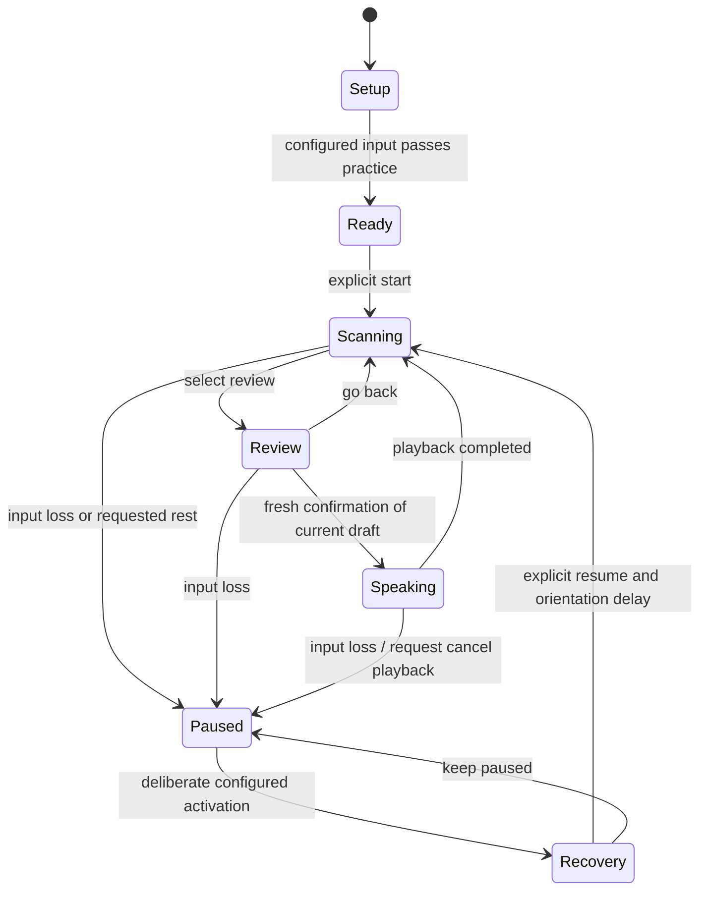

# Continuum

**Communication through your available abilities.**

> **Presentation summary — latest update, 26 September 2026, 12:40 local:** Continuum supports communication and a small set of explicitly approved computer tasks through a usable selection signal. The working app combines switch scanning, personally calibrated mouth/eyebrow camera setup, editable communication, exact-message speech confirmation and draft-preserving recovery. A local count-trained personal ranker learns recurring phrases; a separate **pretrained Qwen3 LLM** proposes wording and supported tools through llama.cpp on the laptop. Guided spoken onboarding now introduces input setup, Yes/No scanning practice and personal-message choices; the default workspace provides local conversation with selectable replies. One selection gesture chooses either highlighted answer. A real browser request → model proposal → explicit confirmation → note creation → file-content inspection was demonstrated. Production build and 85 Vitest plus 6 Node automation tests passed in recorded runs. These are software checks, not clinical evidence. We did not train Qwen3 and do not claim reliable model interpretation of arbitrary intent. Physical-camera and intended-user performance remain unverified. External app launches may require help returning to Continuum. Start with [the current one-page presentation and 60-second demo](PRESENTATION_BRIEF.md); implementation update is in section 27. Existing research and detailed design are preserved below.

**Final problem statement, product specification, engineering plan and hackathon pitch**  
Prepared: 26 September 2026  
Recommended track: BioOrganics & MedTech; Open Innovation is also appropriate.  
Status: Research prototype under implementation. Sections 1–20 retain the detailed design and verification requirements; they are not a blanket claim that every requirement has shipped. The implementation alignment in section 21 and literature synthesis in sections 22–26 were added on 26 September 2026. Companion review: [CONTINUUM_LITERATURE_REVIEW.md](CONTINUUM_LITERATURE_REVIEW.md).

---

## 1. The decision

Build an offline communication interface around one personally usable selection signal. That signal can operate a phrase board and a spelling interface. The person chooses what to say, reviews it, and authorizes speech output.

When the input becomes unavailable, Continuum pauses selection and preserves the message. If the person has another configured, usable input, they can explicitly resume through it. Otherwise, the draft remains available while access is restored or a communication partner helps.

**The central demonstration is completing a message through an input interruption without unintended output.**

This is a stronger nine-hour project than the previously considered satellite wildfire proposal because its essential interaction can be implemented and observed directly. It still requires evaluation with intended users before claims about real-world usefulness.

### Final problem statement

> People with severe speech and hand-control limitations may have difficulty operating both voice interfaces and touch interfaces. Their available input can also become unreliable during a conversation. How can an offline communication system use a personally configured voluntary signal to support independent message initiation, composition and correction, while preserving the message during input interruptions and preventing uncertain detections from becoming unintended speech?

### Research question

> In controlled communication tasks, does explicit input-quality gating and draft-preserving recovery improve completion under input interruptions, while keeping unintended selections and spoken outputs low, compared with the same interface without the recovery workflow?

This comparison evaluates our engineering choices. It does not establish superiority over commercial AAC products.

### What success would look like

A person can initiate “I have something to say,” choose or compose a message, correct a mistake, recover from a tested input interruption, and speak the exact message they approved. The application operates without an internet connection after installation.

## 2. What makes sense in the pasted proposal—and what changes

| Pasted recommendation | Final decision |
|---|---|
| Start with a personally reliable signal | Keep. This gives the product a coherent foundation. |
| Require separate yes and no gestures | Change. One intentional activation is enough for scanning. A second gesture is optional. |
| Treat yes/no calibration as a universal clinical prerequisite | Remove. This is our interface design choice, not a universal rule for access to AAC. |
| Use scanning so users can initiate messages | Keep, with adjustable pacing and an accessible correction route. |
| Include ordinary movements as negative examples | Keep, using movements that actually occur for that person. |
| Preview and confirm before speech | Keep as the prototype default; evaluate its effort cost. |
| Preserve the draft through camera failure | Keep, with a precisely defined recovery state. |
| Switch to a physical button | Conditional: only if this person can actually operate that button. |
| Show “zero unintended selections” | Report only if observed, together with the number of trials and exposure time. |
| Claim competing products assume one stable input | Remove. Existing products support multiple access methods. |
| Add browser automation | Broad control remains deferred. Section 27 documents the later implemented, explicitly approved note/app/website tools; they do not provide full browser control. |

**The primitive is “select,” not “yes.”** Yes and no are messages a person may select. No signal means no action; it does not mean no, refusal, agreement or consent.

## 3. The human problem and intended users

### Dysarthria, explained accurately

Dysarthria is a motor speech disorder. Problems controlling speech movements can affect articulation, voice, breathing, resonance and speech rhythm. Speech may be difficult to understand even when the person knows what they want to communicate. Dysarthria itself is distinct from a language disorder; other difficulties can coexist and must be assessed individually. This project supports communication rather than diagnosing or treating the underlying condition. [ASHA: Dysarthria in Adults](https://www.asha.org/Practice-Portal/Clinical-Topics/Dysarthria-in-Adults/)

AAC—augmentative and alternative communication—includes methods that supplement or replace speech, such as communication boards and speech-generating tools. Access may use direct selection or scanning. An appropriate system is selected around individual abilities and preferences, with professional assessment where needed. [ASHA: AAC](https://www.asha.org/Practice-Portal/Professional-Issues/Augmentative-and-Alternative-Communication/)

### Our initial user profile

An adult who:

- Has difficulty communicating through speech and reliably operating ordinary touch or typing interfaces.
- Can use the prototype's visual choices, or an explicitly implemented alternative presentation.
- Has at least one voluntary signal that the chosen input hardware can detect repeatably.
- Can indicate choices through the configured interaction, with setup assistance if needed.

These are the limits of this prototype, not criteria for whether someone deserves or could benefit from AAC.

### Conditions to consider without claiming universal coverage

| Situation | Potential relevance | Important limit |
|---|---|---|
| ALS or another progressive motor condition | Communication access may need to change over time. | Speech, movement, language and cognition vary; two usable inputs cannot be assumed. |
| Cerebral palsy with speech and upper-limb limitations | A personally selected signal may offer an alternative to touch. | Involuntary movement and posture can complicate camera interpretation. |
| Stroke or acquired brain injury | Some people need alternatives to speech and typing. | Language, attention or visual difficulties may require a different interface. |
| Temporary inability to speak | A board may help express messages. | This version is not validated for acute clinical care or monitoring. |

These examples are consistent with populations discussed in [ASHA's AAC guidance](https://www.asha.org/Practice-Portal/Professional-Issues/Augmentative-and-Alternative-Communication/). They do not establish eligibility for this particular implementation.

### If someone cannot move or speak at all

A webcam and microphone cannot infer intention when they receive no usable voluntary signal. Some people may retain a usable eye movement or switch-accessible movement; others need specialist equipment and assessment. Continuum must never claim to read thoughts, determine consciousness or communicate for everyone with paralysis.

### The societal benefit we are aiming for

The intended benefit is greater control over everyday conversation: initiating a topic, disagreeing, asking a question, correcting a misunderstanding and expressing preferences. The project should not reduce someone's vocabulary to requests for care.

Actual benefit must be established through user evaluation. A successful demonstration is evidence of a functioning prototype, not evidence of improved clinical outcomes.

## 4. The interaction model

### Separate three different things

1. **Observation:** a key transition, facial movement or enrolled vocalization.
2. **Selection event:** a sufficiently supported activation from the currently authorized input.
3. **Meaning:** the item selected in the current interface state.

A gesture does not inherently mean yes, consent, pain or agreement. Its meaning comes from the visible choice the user selects.

### One-signal operation

The interface highlights options sequentially. The user activates their signal when the desired option is highlighted. No activation simply allows scanning to continue. There is always a route to Back, Undo, Pause and Review.

Start with a small linear scan. Use grouped or row-and-column scanning for spelling only after the simpler path works. Scan speed, initial delay and number of loops are configurable. Do not automatically rearrange choices during a scan.

For a gesture that takes time to complete, capture the highlighted target at gesture onset and temporarily hold the highlight. Commit that captured target only when the full gesture is validated and the UI state is unchanged. An aborted gesture must not select whichever option happens to be highlighted later. Bound the hold duration and resume only after a valid neutral state. Measure nuisance-induced scan interruptions as well as false selections, because excessive pausing also harms usability.

### Yes/no as a useful first screen

Offer an optional board containing **Yes**, **No**, **Not sure**, **Please repeat**, **Something else**, and **Back**. The same single signal selects any of these choices. It is a practice and communication screen, not a gate that a user must pass before accessing all AAC.

If two distinct signals are individually usable, a later configuration may map one to Select and another to Back. The prototype must still work with just one.

## 5. Feature scope

P0 is the required demonstration. P1 is added only after P0 is working and checked. P2 is future work.

| Priority | Feature | Required behavior |
|---|---|---|
| P0 | Switch input | Keyboard/HID switch operates the full communication loop without a mouse. |
| P0 | Personal camera input | One selected gesture is calibrated against rest and nuisance movements. |
| P0 | Input quality gate | Missing or stale observations cannot create selections. |
| P0 | Phrase scanning | User can initiate, navigate, select, undo and pause. |
| P0 | Persistent in-session draft | Changing access method does not recreate or clear the draft. |
| P0 | Review and authorized speech | Exact previewed text is spoken only after a new confirmation event. |
| P0 | Explicit recovery | Lost input pauses; a configured backup can resume without selecting content. |
| P0 | Local execution | Model assets and a working local voice are available offline. |
| P0 | Measurement | Event logs, completion times and human-labelled mistakes can be exported. |
| P1 | Spelling | A scanning keyboard supports messages beyond the phrase board. |
| P1 | Profile management | Save, inspect, reset and delete input settings and vocabulary locally. |
| P1 | Draft restoration after reload | Restore text into a paused state; never restore armed speech. |
| P1 | Printable board | Provide a low-tech copy of essential vocabulary. |
| P1 | Personal speech shortcuts | A small optional command set with rejection, if data and time permit. |
| P2 | Auditory scanning | An alternative for users who cannot use the visual presentation, requiring separate evaluation. |
| P2 | Additional languages | User-chosen phrases, script-specific spelling and verified local speech voices. |
| P2 | Specialist input adapters | Integrate supported switches or eye trackers with appropriate access assessment. |

If spelling is not delivered, call the release a phrase-board prototype. Do not describe its vocabulary as unrestricted.

## 6. Personal setup and calibration

### Step A: establish a practical access route

Ask which movement or switch activation is comfortable and repeatable. Do not prescribe a blink, smile or head turn to every user. Setup may be assisted, but the intended user's choices should guide the configuration.

A spacebar is a developer demonstration of a switch interface. It is not proof that a person with severe hand impairment can use the same hardware. A real switch may be positioned for another voluntary movement, subject to individual assessment.

### Step B: calibrate activation versus no action

For the camera prototype, choose one candidate movement and collect:

- Several intentional repetitions with neutral intervals.
- Rest observations.
- Comfortable, ordinary nuisance movements: natural blinking, looking away, repositioning or speaking, as applicable.
- A separate practice block not used to fit thresholds.

Five to ten repetitions and roughly 30 seconds of rest are starting points for a developer exercise, not a clinically validated enrollment protocol. Let the person pause, stop or decline. Do not require uncomfortable movements or claim universal one-minute setup.

### Step C: fit an interpretable baseline

Use normalized landmark features, a threshold, separate activation/release thresholds, a duration condition and a refractory interval. Tune against accidental activations and missed intended events.

For a sustained eye-closure example, require a complete closure-and-reopening pattern with valid tracking throughout. Reject an excessively long or interrupted closure. Covering the camera must not complete the gesture. Eye closure is only an example; ordinary blinking and prolonged closure may make it unsuitable for a particular person.

### Step D: verify on held-out actions

Test selections during actual scanning. An isolated gesture can be detectable yet difficult to time against moving choices. Record missed targets, accidental selections and effort feedback.

If no practical operating point separates intentional actions from nuisance movements, mark the camera input **not ready**. Adjust placement, select another signal or use a different input. Do not lower the threshold merely to make the demo appear responsive.

### Step E: configure recovery

Register a backup only when the person can use it. Practice activating it before the main task. Record whether recovery is independent or requires another person.

## 7. Communication interface

### Layout

Keep four stable regions:

1. Input status: active method, paused state and simple recovery instructions.
2. Message draft: large readable text.
3. Communication choices: a small board with a clear scan highlight.
4. Actions: Review, Undo, Back and Pause, reachable through scanning.

Use readable labels, high contrast and non-colour indicators. Avoid animations that move targets. Keep developer confidence graphs and diagnostic counters in a separate panel rather than crowding the communication view.

### Starter vocabulary

The following is a proposed starter set, edited with the person rather than imposed:

| Purpose | Example messages |
|---|---|
| Take a turn | “I have something to say.” “Please wait.” |
| Correct | “That is not what I meant.” “Let me try again.” |
| Decide | “Yes.” “No.” “I am not sure.” “I disagree.” |
| Ask | “Please explain.” “I have a question.” |
| Privacy | “I would like some privacy.” “Please ask me directly.” |
| Social connection | “Thank you.” “I want to talk.” |
| Comfort and assistance | “I need help.” “Please help me change position.” |
| Personal vocabulary | Names, interests and phrases selected by the user. |

Do not infer a diagnosis or medical response from any phrase. “I need help” is ordinary communication in this prototype, not a monitored emergency alarm.

### Draft and correction

Selecting a phrase adds it to the draft. Undo reverses the last edit. Clear requires an explicit decision. Spelling includes space, backspace, back and review. A user can leave spelling without losing completed text.

The first release may use English for the tested demo. Store text as Unicode and make phrase labels editable. Do not claim language-independent recognition or universal language support.

### Review and speech

Opening Review shows the exact draft and scans **Go back**, **Speak this message**, and **Cancel review**. Speech requires a fresh selection after the review screen has become active and the previous activation has been released.

Bind authorization to the draft revision. Any subsequent edit invalidates it. One activation cannot both enter Review and authorize speech. Each confirmed utterance has an identifier so duplicate events cannot replay it.

Cancel pending speech on input loss before playback begins. If speech is already in progress, request cancellation and show what occurred; already audible words cannot be taken back. Do not replay automatically after recovery.

Preview may be visual. If auditory preview is implemented, explain that it is audible and provide a private listening option where available. A spoken preview should not be mistaken for the user's final message.

Confirmation adds effort and is not a guarantee against error. Later user studies should examine when users prefer shorter interactions. The hackathon default prioritizes an explicit authorization step.

## 8. Recovery: the central engineering contribution

### Input health is separate from intention

Check observation age, camera stream state and tracking availability before interpreting a gesture. Never infer fatigue, refusal, distress or consciousness from a missing face or weak gesture.

Use understandable messages such as “Camera input paused. Your message is saved in this session.” Avoid “You are tired” or “You said no.”

### Loss of camera input

1. Stop accepting camera selections as soon as the quality gate fails.
2. Invalidate any gesture in progress and all pending confirmation events.
3. Freeze scanning and preserve the draft, navigation location and settings.
4. Show the configured recovery route.
5. Accept the first deliberate backup activation only as a request to enter recovery; it must not select a phrase or speak.
6. Present a recovery menu through that backup: Resume, Change input, or Keep paused.
7. After explicit Resume, provide an orientation delay before scanning continues.

One input owns content selection at a time. A backup can request recovery while another source is paused, but cannot inject simultaneous content events. If the camera returns, it does not automatically retake control.

### No backup available

Remain paused with the message intact. Offer a visible assistance instruction and, where available, the printable board. If a partner operates the recovery controls, mark the trial assisted. The application must not silently convert inactivity into a choice.

### State model



On resume from an interrupted review, return to composition or a new review; never preserve an armed Speak action.

### Required invariants

- Unknown observations produce no selection.
- No activation produces a semantic yes or no by itself.
- A held switch or gesture produces at most one selection until released and rearmed.
- Late inference results cannot act on a newer screen or draft.
- A recovery activation cannot also edit or speak.
- Changing input does not clear the draft.
- Speech requires a new authorization of the current draft revision.
- Restarting the application cannot automatically speak a restored message.

## 9. Architecture and implementation choices

### Recommended stack

Use a locally served TypeScript web application, with React if the team already knows it. Keep a single state reducer for communication logic. Bundle model files, fonts and runtime assets locally. Pin dependency versions at implementation time.

Use MediaPipe Face Landmarker as a candidate pretrained observation model. Its output supplies landmark or expression features; it does not establish user intention or clinical suitability. The web API performs synchronous inference, so place the work in a worker where supported and keep scanning responsive. [Google's Face Landmarker web guide](https://developers.google.com/edge/mediapipe/solutions/vision/face_landmarker/web_js)

For TTS, select an installed local voice. The browser exposes a `localService` property, but verify actual playback with networking disabled and after restarting the app. If no working local voice is available, resolve that before claiming offline arbitrary-text speech. [MDN: localService](https://developer.mozilla.org/en-US/docs/Web/API/SpeechSynthesisVoice/localService)

### Data flow

```text
Camera -> pretrained landmarks -> quality gate -> personal event detector --+
                                                                         |
Keyboard / HID switch -> edge detection and debounce ---------------------+-> source arbiter
                                                                         |        |
Optional enrolled speech -> reject-capable command detector --------------+        v
                                                                           state reducer
                                                                                 |
                                                  phrase board / spelling / draft / review
                                                                                 |
                                                                      authorized local TTS
```

### Module contracts

| Module | Responsibility |
|---|---|
| Input adapters | Produce timestamped observations and explicit health status. |
| Personal detector | Convert a completed valid pattern into one activation event. |
| Source arbiter | Accept the authorized source and route backup activations to recovery only. |
| Scan engine | Maintain stable choices, highlight timing and pause/resume behavior. |
| Draft store | Own content independently of input and view lifecycles. |
| Speech controller | Speak only a confirmed text revision; deduplicate and cancel. |
| Local profile store | Store settings and approved persistence preferences. |
| Evaluation logger | Record technical events separately from message content. |

Suggested event fields: event ID, source, monotonic timestamp, input generation, UI state revision and event kind. Use a separate generation number after every pause, source change or reset to reject queued results from the old state.

### Failure details that matter

- Ignore repeated keydown events; require key release before rearming.
- Prevent the activation key from also scrolling or clicking an unrelated control.
- Pause on window blur, hidden-tab transitions and unexpectedly stalled inference.
- Drop late video results rather than processing a growing backlog.
- Test a hand approaching the camera, not just a clean camera disconnect.
- Treat multiple faces or ambiguous tracking as a reason to pause in the first release.
- Keep pointer controls for setup, but demonstrate the communication loop without them.

The laptop GPU can help development, but the core does not need a large language model. Record actual CPU/GPU use and latency. Do not claim mobile or low-end-device performance from this laptop alone.

## 10. The ML contribution

### Baseline first

The first candidate uses a pretrained face model plus personalized temporal thresholds. Describe it accurately as **pretrained perception with personal calibration**. Moving a slider is not training a new deep model.

### Optional small learned detector

If time permits, fit a logistic regression or another small classifier over short windows of normalized landmark features. Inputs could include movement magnitude, duration and return-to-neutral behavior. Labels are intentional activation versus no action; reject invalid observations before classification.

Compare it with the threshold baseline using the same held-out actions and nuisance periods. Retain it only if it improves the measured tradeoff. Do not add a neural network simply to make the project sound more advanced.

### Data splitting

Split by complete gesture repetitions or recording blocks, not randomly by neighboring video frames. Keep tuning examples separate from final evaluation. Add a held-out lighting or camera-position condition where practical. Report results per person and condition.

For a personal detector, testing on new recordings of the enrolled person evaluates personalization. It does not establish generalization to unseen people. Testing on team members does not establish performance for people with motor impairments.

### Optional personalized speech

Only add speech if the communication loop and recovery checks already pass. Use a few personally chosen shortcuts, an explicit unknown/no-action outcome, and held-out recordings. A command may navigate or populate a draft; it should not bypass final speech authorization.

Unrelated speech, silence, background sounds and other speakers belong in evaluation. Do not treat teammates imitating dysarthria as a valid dysarthric-speech dataset. Confirm dataset access, licensing, command coverage and speaker/session splits before committing to a public benchmark.

Apple already supports personally chosen vocal shortcuts with on-device audio processing, including for some users with atypical speech. Personalized offline vocal commands alone are therefore not our novelty claim. [Apple Vocal Shortcuts](https://support.apple.com/en-mide/guide/iphone/iph7f242ea2c/ios)

### LLMs and cloud APIs

Ollama, Kaggle GPUs and OpenRouter are available resources, not requirements. Keep cloud APIs out of the core communication path. No model should invent a person's message, infer consent or automatically complete and speak a sentence. Future word suggestions must remain optional choices, visibly separate from selected text.

## 11. Prior art and the defensible contribution

| Existing work | What the primary source establishes | Implication for our claims |
|---|---|---|
| Apple Vocal Shortcuts | Personally chosen utterances trigger actions; audio is processed on device. | Offline personalized voice shortcuts already exist. |
| Grid 3 | Users can change independently between access methods. | Switching methods is not a new invention. |
| TD Snap | AAC page sets support touch, eye gaze and switches. | Multiple access methods and communication boards already exist. |
| Project Gameface | Facial gestures and head movement support configurable computer interaction. | Webcam gesture access already exists. |

Sources: [Apple](https://support.apple.com/en-mide/guide/iphone/iph7f242ea2c/ios), [Grid](https://hub.thinksmartbox.com/knowledgebase/how-do-i-change-between-two-access-methods-in-grid-3/), [TD Snap](https://us.tobiidynavox.com/products/td-snap), [Project Gameface](https://developers.googleblog.com/project-gameface-launches-on-android/).

Our proposed contribution is an inspectable implementation and evaluation of a specific workflow: personal activation, uncertain-input rejection, draft preservation, explicit recovery and authorization of spoken output.

**This is an engineering contribution to demonstrate, not a verified first-of-its-kind claim.** We have not established that commercial AAC lacks these protections. A product comparison would require hands-on testing with matched configurations and users.

The project can be impressive through completeness, transparent failure handling and credible measurements. Its success does not depend on pretending that AAC is a new category.

## 12. Evaluation plan

### Separate three levels of evidence

1. **Software correctness:** the state machine obeys its invariants under injected events.
2. **Developer usability and robustness:** consenting team members complete tasks under controlled conditions.
3. **Intended-user usefulness:** future co-design and evaluation with AAC users and relevant professionals.

The hackathon can address the first two. Do not merge them into a claim of clinical validation.

### Tasks

| Task | Purpose |
|---|---|
| Select a short phrase and speak it | Basic end-to-end operation. |
| Select a wrong phrase, undo, then complete the target | Accessible error correction. |
| Compose an off-board word, if spelling exists | Vocabulary expansion. |
| Interrupt camera input during composition | Draft preservation and controlled recovery. |
| Interrupt input while Review is open | Prevent stale confirmation. |
| Leave the interface idle during ordinary movements | Estimate unintended activations under nuisance conditions. |
| Restore the camera after switching inputs | Verify no automatic takeover or duplicate action. |
| Restart offline | Verify assets, local TTS and safe restoration behavior. |

### Comparisons

- **Detector:** global threshold versus personal threshold; optional learned detector on the same evaluation set.
- **Workflow:** same UI with primary-input-only operation versus configured recovery during matched interruptions.
- **Normal operation:** measure any extra time or activations introduced by recovery and confirmation features.

The primary-input-only comparison intentionally isolates recovery. It is not a stand-in for commercial AAC. If feasible, also compare a simple manual input selector that preserves the draft, which is a stronger baseline for the added recovery UI.

Counterbalance task order where possible. Use a fixed task timeout chosen before testing and report unfinished trials. Never calculate mean completion time only on successes without reporting failures.

### Metrics and definitions

| Metric | Definition |
|---|---|
| Correct completion | Target message spoken correctly, with required authorization, within the task limit. |
| Unintended selection | A selection inconsistent with the instructed target or the participant's reported intention. |
| Unintended spoken output | Speech started without the intended authorization or with unintended text. |
| False activations per minute | Labelled false activation events divided by measured no-action exposure time. |
| Missed activation rate | Intended activation attempts not accepted divided by labelled intended attempts. |
| Completion time | Task start to completion; unfinished trials reported separately. |
| Recovery time | Induced interruption to first intentional post-resume content selection. |
| Activation burden | Total intentional activations needed per completed message. |
| Pause-detection delay | Injected input loss to the application entering its paused state. |
| Event latency | Labelled completed input action to UI response, with timestamp method stated. |
| Setup burden | Time, repetitions, assistance and unsuccessful calibration attempts. |
| Subjective effort | Brief participant feedback; exploratory, not a validated clinical measure. |

**The system cannot infer whether its own selection was unintended.** Mistake counts need scripted targets, participant confirmation or an observer. Do not display a fabricated zero-error counter merely because no error was automatically detected.

### Small hackathon test set

Aim for several short runs per condition across available consenting developers, rather than a single rehearsed success. Include complete idle periods and repeated camera interruptions. Report the actual sample size, duration, hardware, chosen gestures and assistance.

If no errors occur, report “0 observed unintended outputs in N trials over T minutes.” This is not a guarantee or a reliable estimate of extremely rare failure rates. No target accuracy is asserted in advance.

### Results table to fill after testing

| Measure | Baseline | Continuum | Conditions / denominator |
|---|---|---|---|
| Correct task completion | Not measured | Not measured | Record trials and timeout |
| Unintended selections | Not measured | Not measured | Record trials and idle minutes |
| Unintended spoken outputs | Not measured | Not measured | Record authorization attempts |
| Median completion time | Not measured | Not measured | Include completion rate |
| Median recovery time | Not measured | Not measured | Record independent/assisted |
| Activations per completed message | Not measured | Not measured | Use matched messages |
| Offline restart and speech | Not tested | Not tested | Network disabled |

## 13. Acceptance checks before the demo

These checks target meaningful state and access failures. Do not spend the hackathon writing tests that only mirror visual components.

- [ ] The full phrase-to-speech loop works through one switch without mouse assistance.
- [ ] Holding the switch cannot generate repeated selections.
- [ ] A camera gesture completes only once and rearms only after release.
- [ ] A gesture begun on one scan target cannot select a later target because recognition took time.
- [ ] Covering the camera mid-gesture causes no selection from the interrupted gesture.
- [ ] Input loss during Review cannot authorize speech.
- [ ] The first backup activation enters recovery without changing content.
- [ ] Returning camera frames cannot retake control after switching inputs.
- [ ] A stale inference result is rejected after navigation or pause.
- [ ] Editing the draft invalidates previous speech authorization.
- [ ] Input changes preserve the draft exactly.
- [ ] With no backup, the application remains paused and explains the limitation.
- [ ] Local assets and a local TTS voice work after an offline restart.
- [ ] A restored draft cannot speak automatically.
- [ ] Error counts shown to judges have a stated labelling method and denominator.

## 14. Nine-hour implementation plan

This is a schedule from project start, not a claim about time remaining. If hours have already elapsed, reduce scope using the cut order below. Parallel tracks need a shared event contract before integration.

| Time | Communication / UI track | Input / ML track | Validation / evidence track |
|---|---|---|---|
| 0:00–0:30 | Define states, events, draft ownership and small phrase set. | Verify camera/model assets and input adapter contract. | Lock claims, source links and test tasks. |
| 0:30–2:00 | Build switch scanning, draft, Undo and Review. | Prototype one camera gesture and quality gate. | Verify local TTS and offline asset availability. |
| 2:00–3:30 | Finish switch-to-speech loop; add Pause. | Add personal calibration and practice block. | Check held input, duplicate events and confirmation. |
| 3:30–5:00 | Integrate recovery menu and draft preservation. | Test occlusion, stale frames and explicit source ownership. | Run interruption checks and log outcomes. |
| 5:00–6:00 | Add spelling if core is stable; otherwise fix core. | Compare personal threshold to a simple baseline. | Run matched developer tasks and idle periods. |
| 6:00–7:00 | Polish legibility and correction paths. | Add learned detector only if justified; otherwise stop. | Analyze results, report failures and prepare evidence slide. |
| 7:00–8:00 | Freeze features and fix critical defects. | Confirm offline operation after restart. | Record a backup demo and finalize pitch. |
| 8:00–9:00 | Rehearse the exact accessible workflow. | Keep a tested input profile ready. | Rehearse questions and verify reported numbers. |

### Decision gates

- By hour 2: switch scanning must work. If not, pause camera work and complete it.
- By hour 4: if camera input cannot distinguish intent reliably in the test setting, simplify the gesture or demonstrate switch access with transparent camera limitations.
- By hour 5: require draft-preserving recovery and safe Review. Cut speech shortcuts and optional models if incomplete.
- During the final two hours: no new input modalities, remote APIs or major dependencies.

### Cut order

Cut LLM suggestions, browser control, additional gestures, personalized speech, learned detector, visual polish and secondary languages before cutting correction, explicit confirmation, recovery or offline verification.

If spelling is cut, label the limitation clearly. If independent recovery cannot be demonstrated, describe the result as assisted recovery instead.

## 15. Three-minute demonstration

Use a consenting team member. State that this is a developer demonstration; do not ask them to imitate a disability.

1. **0:00–0:25 — Explain the task.** The participant will create a message using a configured signal. Show the available backup and state that both are usable by this demonstrator.
2. **0:25–0:50 — Show personal calibration.** A short live practice block illustrates intentional activation versus rest. If a profile was prepared earlier, say so. Do not present it as a new model trained from scratch.
3. **0:50–1:25 — Initiate and compose.** Select “I have something to say” or a personal phrase. Show one correction.
4. **1:25–2:05 — Interrupt access.** Cover the camera. The system pauses. The participant uses the configured switch to enter recovery and explicitly resume. The draft remains unchanged.
5. **2:05–2:35 — Review and speak.** Complete the message and authorize its exact text.
6. **2:35–3:00 — Show evidence.** Present measured results from multiple runs, along with one limitation and the next user-validation step.

Choose timing only after rehearsing at the configured scan speed. Do not speed the scanner beyond the demonstrator's reliable ability to fit the script. A recorded backup must be labelled as recorded.

## 16. Pitch and judge questions

### Opening

> “A communication tool has to help a person choose their own words, and recover when the input stops working. Continuum starts with one personally usable selection signal. That signal can select a phrase, correct it and authorize speech. If access is interrupted, the message stays intact while the person resumes through an available method.”

### Ninety-second pitch

> “For someone who has difficulty both speaking and using their hands, a conventional voice or touch interface may be hard to operate. We built Continuum around a smaller requirement: one voluntary signal that can be detected reliably enough for this person's setup.
>
> “That signal operates a scanning communication board. The user initiates messages, makes corrections and approves exactly what is spoken. Silence is never interpreted as yes or no.
>
> “Our demonstration focuses on interruption. When the camera input fails, selection pauses and the draft stays intact. A person who has a configured backup can explicitly resume through it. If they have no usable backup, the system stays paused rather than inventing a choice.
>
> “AAC products and alternative input systems already exist. Our contribution is this transparent recovery workflow and its measured behavior under controlled failures. We will show our actual results, including limitations. The next step is co-design and evaluation with intended users and accessibility professionals.”

Do not add performance numbers to the pitch until measured.

| Judge question | Honest answer |
|---|---|
| Is this new? | The components exist. We are demonstrating and evaluating a particular recovery and authorization workflow; we are not claiming to have invented AAC. |
| Where is the AI? | A pretrained perception model extracts facial features; personal calibration and a temporal detector interpret the selected movement. The implemented local language component learns phrase/context counts and word bigrams from explicitly approved messages. It is a statistical personal language model, not a general LLM trained from scratch. |
| Why not just use a button? | If a button meets the person's needs, it is a good input. Camera access is an additional option, not an automatic improvement. |
| Why not just use yes/no? | A scanned vocabulary lets the user initiate and choose topics instead of only answering questions chosen by someone else. |
| Does it work for ALS or cerebral palsy? | Those are possible use contexts. Our prototype still needs individual access assessment and intended-user evaluation. |
| What if the person cannot operate the backup? | It cannot provide independent recovery through that backup. The interface stays paused and preserves the message. |
| What if the camera mistakes a blink? | We evaluate nuisance movements, require temporal conditions, reject invalid tracking, support correction and require new speech authorization. These measures reduce risk but do not guarantee perfect recognition. |
| Why no cloud model? | The core interaction can work locally, avoiding connectivity dependence and unnecessary transmission of personal signals. |
| What would you measure next? | User-chosen task completion, effort, setup burden, recovery and unwanted actions with intended users across real conditions. |

## 17. Privacy and user control

These are product requirements to implement and verify:

- Process camera frames locally and discard them after inference by default.
- Do not save raw audio or video without a separate, explicit choice.
- Keep diagnostic logs content-free by default: event kind, timing, state and source.
- Offer deletion of profiles and logs. Make exports deliberate.
- Keep drafts in memory by default; make persistence beyond the session a visible preference.
- Explain that local storage on a shared laptop is not automatically encrypted or private from other device users.
- Avoid cloud telemetry and remote font/model dependencies in the tested release.
- Let the person change vocabulary and inspect what will be spoken. Helper edits must not silently speak on their behalf.

The project does not determine medical consent, diagnose a condition, control a wheelchair or operate life-critical equipment. Those are outside this build's scope.

## 18. What we can claim

| Appropriate after verification | Unsupported claim to avoid |
|---|---|
| “The prototype ran offline on this laptop.” | “Works offline on every phone.” |
| “This calibrated gesture worked in these test conditions.” | “Understands any person's yes.” |
| “The draft survived the tested input interruptions.” | “Other AAC products lose drafts.” |
| “No unintended speech was observed in N trials.” | “Zero-error communication.” |
| “The system paused when tracking became invalid.” | “Detects fatigue or knows the person is distressed.” |
| “The participant resumed using a configured switch.” | “Anyone who cannot move can use it.” |
| “A personal detector improved our held-out benchmark.” | “Clinically validated for dysarthria.” |
| “This workflow is our evaluated contribution.” | “The world's first multimodal AAC.” |

## 19. After the hackathon

The first next step is to validate the problem and workflow with people who use AAC and professionals who support access, rather than add more AI.

Ask which communication interruptions actually matter, how often they happen, which recovery routes are usable, and whether our confirmation step creates too much effort. Test comfortable setups across sessions, posture changes, lighting and ordinary conversation. Offer breaks and preserve the person's existing communication method throughout any trial.

Prioritize improvements based on that evidence: access flexibility, easier setup, better correction, language support or hardware integration. Compare with existing products hands-on before claiming a product gap. A future user study needs an appropriate consent and ethics process; the hackathon deadline is not a reason to rush vulnerable participants into testing.

## 20. Sources and evidence boundaries

Primary product and professional sources checked on 26 September 2026. Product pages establish advertised capabilities; they do not independently prove comparative performance. The implementation choices and test plans in this document are our proposals.

1. [ASHA — Dysarthria in Adults](https://www.asha.org/Practice-Portal/Clinical-Topics/Dysarthria-in-Adults/): motor speech background.
2. [ASHA — Augmentative and Alternative Communication](https://www.asha.org/Practice-Portal/Professional-Issues/Augmentative-and-Alternative-Communication/): AAC, individual assessment, access methods and populations.
3. [Apple — Use Vocal Shortcuts on iPhone](https://support.apple.com/en-mide/guide/iphone/iph7f242ea2c/ios): personalized utterances and on-device processing.
4. [Smartbox — Change between access methods in Grid 3](https://hub.thinksmartbox.com/knowledgebase/how-do-i-change-between-two-access-methods-in-grid-3/): existing independent access switching.
5. [Tobii Dynavox — TD Snap](https://us.tobiidynavox.com/products/td-snap): existing AAC page sets and access methods.
6. [Google — Project Gameface launches on Android](https://developers.googleblog.com/project-gameface-launches-on-android/): configurable facial/head interaction.
7. [Google — Face Landmarker web guide](https://developers.google.com/edge/mediapipe/solutions/vision/face_landmarker/web_js): candidate perception runtime and threading considerations.
8. [MDN — SpeechSynthesisVoice.localService](https://developer.mozilla.org/en-US/docs/Web/API/SpeechSynthesisVoice/localService): local voice indicator; offline functionality still requires testing.

**Build commitment:** complete the switch communication loop first, add one personally calibrated camera signal, preserve the draft through explicit recovery, and report what the prototype actually demonstrates.

## 21. Implementation alignment — 26 September 2026

This section distinguishes inspected code from future possibilities. Live camera suitability and intended-user benefit still require separate evaluation.

| Component | Current implementation inspected | Boundary |
|---|---|---|
| Camera perception | MediaPipe facial blendshape features; personally chosen mouth opening/closing or eyebrow raising/relaxing. | This is not eye-gaze tracking, lip reading, emotion recognition, or a brain–computer interface. Neither movement is suitable for every person. |
| Gesture decision | Personal rest, intentional-movement and nuisance samples; separate practice; activation/release thresholds and temporal state. | Calibration of a signal does not establish medical suitability or prove its meaning. Natural movement can resemble an intended action. |
| Language assistance | Local frequency/context phrase ranker and smoothed unigram/bigram language model in `src/intelligence`; authored starter vocabulary and personal additions. | This is not a pretrained LLM, a generative model trained from scratch, or dysarthric ASR. |
| Personal learning | Explicitly approved text is learned when speech begins, when learning is enabled; mere suggestions and unspoken drafts do not train the model. | A confirmed phrase is a user action in this interface, not medical consent or proof that the emitted speech was heard. |
| Language data | Bounded local phrase history; inspectable counts; reset and validated import/export API. | JSON exports contain readable text. Local storage is not encryption. |
| Output | Exact reviewed text through an available local system voice; visual message remains an alternative. | A voice marked local must still be tested offline on the actual browser/OS. |

The language module's tests establish functional adaptation on synthetic preference replay, not clinical accuracy. Its measured latency is an engineering result for this machine and workload; it is not a measure of communication speed. See [the model card](src/intelligence/MODEL_CARD.md) and reproduce the benchmark before using figures in a presentation. Do not relabel runtime phrase counts as neural-network training.

## 22. Who may benefit, and who this prototype does not cover

The most defensible initial user is an adult with unreliable speech and hand access who can use the presented choices and intentionally produce one detectable, comfortable signal. The diagnosis alone does not determine that fit. Setup support may be necessary; independent message authorship remains the goal.

| Population or impairment | Why it is relevant | What must not be assumed |
|---|---|---|
| Dysarthria | Speech movement difficulties can make ordinary ASR unreliable; hand access may also be affected. | Dysarthria is not synonymous with inability to understand language, paralysis, or need for AAC. Coexisting impairments matter. |
| ALS / motor neurone disease | Speech and physical access can change over time. | A mouth movement, eye movement, second input, and unchanged cognition are not guaranteed. |
| Cerebral palsy | Some people have combined speech and hand-control difficulties. | Movement, vision, language, cognition and involuntary motion vary; children's needs cannot be inferred from an adult prototype. |
| Stroke | Motor speech impairment may coexist with arm/hand impairment. | Aphasia affects language; apraxia of speech concerns movement planning. Neither is simply dysarthria. A text interface may be unsuitable for some people. |
| Classic locked-in syndrome | Some conscious people retain intentional eye or eyelid movement despite profound paralysis. | The current mouth/eyebrow implementation may not match that remaining ability. Complete loss of observable voluntary movement is outside webcam/microphone access. |
| High cervical spinal cord injury | Conventional typing can be inaccessible; some high injuries complicate speech or ventilation. | Loss of hand control does not necessarily imply loss of speech. |
| Temporary intubation or critical illness | Some awake patients need nonvocal communication. | Alertness, attention, fatigue, vision and comprehension fluctuate. This is not a validated ICU communication or alarm system. |

Clinical foundations: [ASHA dysarthria](https://www.asha.org/Practice-Portal/Clinical-Topics/Dysarthria-in-Adults/), [NIDCD aphasia](https://www.nidcd.nih.gov/health/aphasia), [NIDCD apraxia](https://www.nidcd.nih.gov/health/apraxia-speech), [NIH GARD locked-in syndrome](https://rarediseases.info.nih.gov/diseases/6919/locked-in-syndrome), [MSKTC spinal-cord-injury guide](https://msktc.org/sites/default/files/2023-09/MSKTC-SCI-Booklet-English-083023.pdf), [NHS critical-care communication](https://www.guysandstthomas.nhs.uk/health-information/critical-care-and-communicating-your-family-member).

## 23. Quantitative evidence: use the denominator with every percentage

These are historical study findings. None estimates the worldwide number of suitable Continuum users. Do not add overlapping diagnoses, substitute AAC need for AAC use, or multiply these percentages by India's population.

| Evidence | Verified population / period | What the number means | What it does not mean |
|---|---|---|---|
| **43% speech impairment; 17.3% acquired AAC equipment** | Elliott et al., 2020; 371 people with MND in the Scottish registry, cross-sectional baseline. | Two different observed outcomes within that MND cohort. | Not 82.7% unmet AAC need; not ALS-only global prevalence. [Study](https://pubmed.ncbi.nlm.nih.gov/31594398/) |
| **46% had communication devices requested; 39% communication-device procurement failure** | Funke et al., 2018; 1,494 people in 12 German ALS centres, June 2013–May 2017; cohort required a documented assistive-device request. | Requested need and failed provision are distinct denominators. | Not 39% of all people with ALS unable to communicate; not evidence that software alone resolves procurement barriers. [Full paper](https://als-charite.de/wp-content/uploads/2020/12/Publikation-zur-Hilfsmittelversorgung-bei-der-ALS-in-ALS-FTDG-2018.pdf) |
| **11 of 35 children needing AAC had communication aids: 31.4%** | Lillehaug, Klevberg & Stadskleiv, 2023; 95 Norwegian preschool children with CP; mean age 39.4 months. | Aid provision within the study-defined need subgroup. | Not 31.4% of all 95 children; not all CP worldwide; other forms of support are not equivalent to having a device. [Study](https://pubmed.ncbi.nlm.nih.gov/37212772/) |
| **42% dysarthria (95% CI 35–48); 30% aphasia (95% CI 25–37)** | Flowers et al., 2013; 221 reviewed first-ever acute ischemic-stroke cases at one Canadian centre, registry 2003–2008. | Acute impairment estimates in that clinical sample. | Not permanent impairment rates; not the fraction needing this application; the conditions overlap. [Study](https://pubmed.ncbi.nlm.nih.gov/23642855/) |

These studies support the existence of communication and access barriers. They do not supply a market-size estimate or prove Continuum improves outcomes. For locked-in syndrome, this review found no defensible population percentage of people suitable for this exact webcam interface; do not invent one. The supporting review explains why some frequently repeated ICU figures were deliberately not promoted to a headline.

## 24. Exact prior art and the claim we can defend

| Existing work | Verified overlap with Continuum | Consequence for our pitch |
|---|---|---|
| Apple Eye Tracking / Vocal Shortcuts | Mainstream camera-based eye access and on-device customized vocal actions. | Neither on-device AI nor camera access is new. [Apple](https://www.apple.com/newsroom/2024/05/apple-announces-new-accessibility-features-including-eye-tracking/) |
| Intel ACAT | Open-source assistive communication, keyboard simulation, prediction and speech synthesis. | Do not claim the first free, predictive or customizable AAC system. [Official repository](https://github.com/intel/acat) |
| Smartbox Grid 3 | Documented independent switching between access methods. | Do not claim competitors require one permanent input method. [Guide](https://hub.thinksmartbox.com/knowledgebase/how-do-i-change-between-two-access-methods-in-grid-3/) |
| TD Snap | Touch, gaze and switch access; prevention of accidental repeated gaze selection. | Multiple access methods and safeguards already exist. [Product](https://us.tobiidynavox.com/products/td-snap), [anti-repeat setting](https://us.tobiidynavox.com/blogs/support-articles/how-to-prevent-accidental-selections-with-eye-gaze-in-td-snap) |
| Cboard | Open-source web AAC, offline support on specified Chrome platforms, scanning. | Offline browser AAC and single-switch boards are established. [Product](https://www.cboard.io/en/), [scanning implementation](https://www.cboard.io/en/blog/2018-09-14-scanning-feature-is-freed-to-the-community/) |
| Google Gameface | Head/facial gesture control with configurable expression thresholds. | Mouth/eyebrow activation is direct prior art, not our scientific invention. [Developer article](https://developers.googleblog.com/project-gameface-launches-on-android/) |
| Google Euphonia / Relate | Personalized recognition of atypical speech. | Speech personalization is established; it is also a different task from our camera input. [Research project](https://sites.research.google/euphonia/about/) |
| SpeakFaster | LLM-assisted abbreviated text entry evaluated with AAC users. | AI suggestions and fewer typing actions are existing research directions. [Cai et al., 2024](https://pubmed.ncbi.nlm.nih.gov/39487163/) |

Product pages document advertised capabilities. We have not conducted equivalent hands-on tests of every product. An unmentioned feature is **unknown**, not absent. Pricing, supported hardware and offline behavior require platform-specific verification before comparison.

**Our strongest defensible contribution is an inspectable, locally operating communication workflow whose recovery and authorization behavior is evaluated under controlled input failures.** Whether it offers a practical advantage over established products remains a research question.

## 25. Strongest research possibilities, ranked by evidence we could obtain

| Priority | Testable hypothesis | Baseline and outcome | Main failure to watch |
|---|---|---|---|
| 1: interruption recovery | Pausing uncertain input and preserving the draft reduces failed communication during camera interruptions. | Same interface with and without recovery; correct completed messages, recovery time, helper interventions, unintended speech. | A backup that the person cannot use does not provide independent recovery. |
| 2: intentional-action validation | Personal calibration including nuisance movements reduces false selections compared with a fixed threshold. | Separate-session recordings; false selections per idle minute and missed deliberate gestures together. | A detector can appear safe by rejecting everything. |
| 3: personal vocabulary ranking | Learning only approved phrase use reduces selection effort for recurring messages. | Static order and frequency-only baseline; total selections, correction cost and message completion time. | Suggestions can add reading burden or destabilize learned locations; freeze ordering during scans. |
| 4: confirmation burden | Explicit preview/confirmation reduces unintended spoken messages without unacceptable effort. | Counterbalanced controlled tasks; unintended output plus extra time/actions and user preference. | Mandatory confirmation can become excessive for some users. |
| 5: longitudinal access fit | Explicitly chosen profiles remain more usable as posture, comfort or available movement changes. | Repeated sessions with intended users; calibration time, sustained usability, breaks and abandonment. | Do not infer fatigue or disease progression from tracking scores. |
| 6: language and identity | User-authored local phrases and verified local voices better preserve personal expression. | Co-design across languages; comprehensibility, authorship, perceived identity, editing burden. | Translating menus alone is not language validation. |

These are proposed contributions, not published results. Multi-input access can trade speed for fewer errors: Fager and colleagues' preliminary study found slower typing but lower total errors with combined eye tracking and scanning, with differing individual responses. That evidence argues for individual choices rather than universal claims. [Fager et al., online 2022 / issue 2023](https://pubmed.ncbi.nlm.nih.gov/35298355/)

Generative language assistance was subsequently implemented as a separate optional branch (section 27); comparison against the lightweight personal model is still future evaluation. A larger model is not automatically better: suggestions must preserve the person's meaning, permit correction and never auto-speak. No general language model was trained from scratch for this project.

## 26. Societal outcomes and a responsible next study

The intended outcomes are initiating a conversation, disagreeing, correcting another person's interpretation, maintaining relationships, expressing ordinary preferences and participating in decisions. Asking for care is one part of communication, not the whole vocabulary.

Evaluate outcomes at three levels:

1. **Engineering:** reproducible state transitions, draft preservation, latency, local execution and error recovery. Developer tests can establish these within their test conditions.
2. **Access usability:** a person's actual selection accuracy, effort, comfort, setup burden, repair success and need for assistance. These require intended-user participation, not a team member pretending to have a disability.
3. **Participation:** whether the person communicates more of what they want in daily life, feels in control and chooses to continue using the system. These require longer observation and cannot be inferred from model accuracy.

Recruit through appropriate AAC/rehabilitation partners, co-design the questions with users, provide accessible consent and compensation, retain each person's established communication method, and avoid life-critical tasks. Report individual results as well as aggregates because ability profiles vary. Benchmark against an appropriate existing access method selected with the person, not a deliberately weak comparison.

For a presentation, prefer two well-labelled study statistics from section 23, one honestly demonstrated recovery task, and one measured local benchmark. A precise claim is more credible than a large unsupported estimate. Full study details, bibliography, exclusions and remaining uncertainty are in [CONTINUUM_LITERATURE_REVIEW.md](CONTINUUM_LITERATURE_REVIEW.md).


## 27. Implemented local LLM and reviewed computer tasks — 26 September, 12:40 local

This update supersedes earlier future-only statements about the optional generative assistant. The original design and literature sections remain a record of requirements and evidence, not a claim that every feature shipped.

### The additional problem

A usable communication interface does not by itself make an ordinary computer task accessible. A person may be able to select a request but still be unable to perform the clicks needed to save a thought or open a resource. The implemented extension tests a bounded question: **can the same accessible workspace carry a request through a visible tool proposal, explicit authorization and inspectable result without treating generated output as consent?**

### Actual implementation

| Layer | What it does | Boundary |
|---|---|---|
| Personal ranker | Learns counts/context/word transitions from approved phrases in the browser. | Small online statistical model; no pretrained LLM in this module. |
| Optional local LLM | Pretrained Qwen3 through a loopback llama.cpp endpoint; GPU-backed 1.7B configuration now verified; original browser-to-note demonstration used 0.6B. | Not trained by the team; 0.6B remains a configured fallback. Generated meaning can be wrong. |
| Proposal UI | Shows one supported tool, exact arguments, cancel and confirm controls. Draft revisions/input loss invalidate pending proposals. | A displayed suggestion is not authorization. Review requires the user to understand the shown choice. |
| Executor | Validates the tool and arguments; executes by server-issued proposal ID following confirmation; rejects reused proposals. | Does not accept arbitrary shell commands or general desktop instructions. |
| Result | Displays a tool receipt; notes can be inspected on disk. | A successful launch request is not evidence that an external UI is visible, usable or controlled. |

Supported tools are: create a new local UTF-8 note; request Calculator or Notepad launch; request an HTTPS Wikipedia article, Google search or weather.com page subject to server validation. Website access is external network activity: its destination receives the requested URL and any search terms. Planning and language inference remain local. Opening an external app/browser can move focus outside the accessible workspace. **Returning may require assistance; independent end-to-end desktop operation has not been established.** The note workflow is therefore the strongest short live demo.

### Evidence that exists

At approximately 12:30 local, a developer used the actual browser and local model to select **Save a thought**, request a proposal, inspect the proposed note, explicitly confirm and receive the creation receipt. The corresponding file content was then checked on disk. That demonstrates one complete real path, not a general semantic-accuracy rate. One warm proposal displayed **0.31 seconds**; that is a single observation, not a benchmark.

At 12:33, **85 Vitest tests in 9 files** passed, including app/hook tests for confirmation, exact proposal-ID submission, duplicate suppression, stale-response cancellation, input-loss invalidation and malformed metadata rejection. The separate automation suite has **6 Node tests** passing in its recorded run. Production TypeScript/Vite build passed. Refer to VERIFICATION.md for subsequent counts and precise test scope. Tests with mocked HTTP establish interaction logic; they do not establish model output quality. Actual model testing has produced incorrect or unsupported proposals, reinforcing the need to preserve the original request and permit cancellation.

### Next evaluation

Use held-out requests across the three supported tools plus ambiguous, unsupported and multi-action requests. Independently label tool correctness and exact argument fidelity; report refusals, invalid responses and semantic mistakes separately. Compare confirmation comprehension and effort with direct deterministic shortcuts. Include wrong but structurally valid proposals in an accessible, consented simulation to determine whether users detect them; do not measure only successful demos. Evaluate external-window return separately before calling the system an independently usable desktop assistant. No clinical efficacy, prevention of harm or reduction in caregiver effort follows from the current demo.

